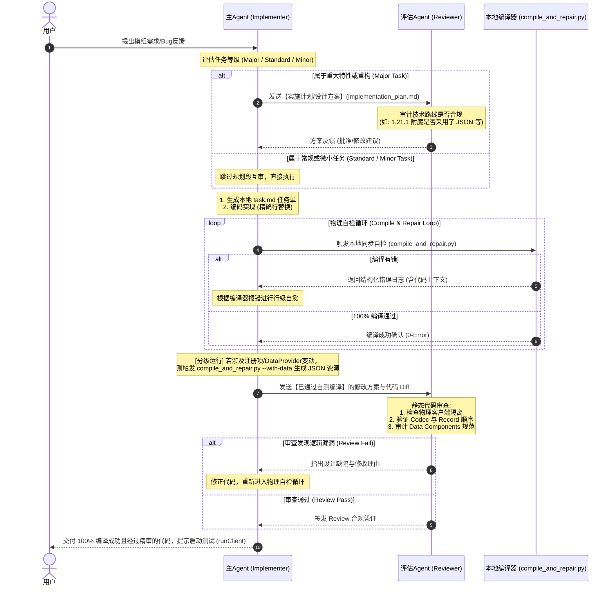

# 升级版双 Agent 协同模组开发工作流

为了解决大模型文本“盲审”在 Minecraft 1.21.1 / NeoForge 模组开发中容易导致的“编译报错、死循环套娃争论”等痛点，我们设计了以下**“物理编译编译器充当终极网关”**与**“分级设计审计”**的升级版协同流程。

---

## 📊 协同开发时序图 (Mermaid)

---

## ⚙️ 核心角色与流转逻辑解析

### 1. 主 Agent（Implementer - 敏捷执行者）
* **定位**：代码编写、本地检索、自愈调试。
* **优势利用**：结合其极长上下文与极速响应速度，能够多次高频与本地 MCP 工具及文件交互，进行快速的行级代码修改。

### 2. 评估 Agent（Reviewer - 高维精审员）
* **定位**：架构合规审计、逻辑死角查杀。
* **优势利用**：凭借其强大的逻辑推理能力，专项排查 MC 模组开发特有的硬性红线（如事件总线 bus 参数漏写、物理客户端代码泄漏导致专服崩溃、Codec 与 Record 构造函数字段顺序错位等）。

### 3. 本地编译器（`compile_and_repair.py` - 真理检验网关）
* **定位**：编译自检与语法防御。
* **核心价值**：**主 Agent 在编译不通过时，绝不将代码发给评估 Agent**。这样避免了 AI 在“语法缺失、漏写分号、漏 import”等低级错误上浪费 Token。只有在自测脚本成功运行（根据变动分级，按需包含 DataGen 成功校验）后，代码才会流向评估 Agent 进行高级架构精审，从而极大提升系统开发效率。

---

## 🛡️ 分级审计机制 (Tiered Audit Mechanism)

为了在“确保方向不跑偏”与“维持高流畅度”之间取得黄金平衡，避免 AI 陷入琐碎修改的无限学术辩论，我们设计了以下任务分类处理标准：

| 任务类型 | 定义与范围 | 规划阶段 (Plan) 互审 | 执行阶段 (Code) 审查 |
| :--- | :--- | :---: | :---: |
| **微小调整 (Minor)** | 修改数值、格式化代码、加注释、修复简单编译错误 | ❌ **免审** (直接执行) | ❌ **免审** (编译通过即交付) |
| **常规开发 (Standard)** | 新增普通物品/方块、加静态配方、微调已有 GUI、增加普通事件监听 | ❌ **免审** (直接执行) | ✅ **需要审查** (编译后由 AI 精审代码) |
| **重大特性/重构 (Major)** | 新增实体 AI、网络数据包 Payload、Mixin 字节码注入、自定义 Capability 存档、Worldgen 世界生成注册 | ✅ **强制互审** (在动手前先对齐方案) | ✅ **需要审查** (编译后由 AI 精审代码) |

### 🛠️ 执行细则：
1. **跳级策略**：若重大特性的规划方案经过 **2 次** 沟通仍无法对齐，主 Agent 将自动挂起互审，并向人类用户（User）抛出具体分歧，由人类进行最终设计决策，防止 Token 空转。
2. **本地先行**：即便在 Major Task 下，主 Agent 修改后的代码也必须在**本地物理编译通过**后，才能再次送呈评估 Agent 做 Code Review。
