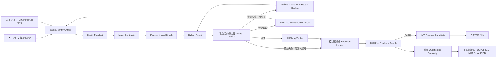

> [!NOTE]
> **历史设计归档声明**：关于 `studio/` 沙箱引擎与 Task Envelope 的实验性规划已裁撤精简。本文档仅保留作为工具包演进的历史设计决策记录。

| 项目 | 内容 |
| --- | --- |
| 状态 | v1.3 provisional core 已落地；v1.4+ 仍是 RFC / PARKED 路线，不表示旗舰工作室目标已经实现 |
| 当前基线 | `.agents` v1.3.0 provisional pilot |
| 目标版本 | v1.3.0 → v1.9.0 → v2.0.0 |
| 适用范围 | Minecraft Java 1.21.1 + NeoForge 21.1.x |
| 核心原则 | 模型无关、证据优先、失败关闭、触发式演进、复杂度受限、可恢复、可移植 |

> 实施边界（2026-07-28）：v1.3 控制面代码与负向测试已经进入仓库；当前通用 starter 没有擅自附带某个玩法合同或假 GameTest，因此 `major` / strict 在宿主未提供真实 `docs/features/*.json` 与行为测试时会按设计失败。Linux bubblewrap 是目前唯一可声称强隔离的后端；Windows 只运行可移植单测，不降级伪装成安全沙箱。下文 v1.4+ 仍是路线图。

## 结论

当前 v1.3.0 已落地最小 Evidence Spine（合同 v2、精确 GameTest 追踪、外置证据、执行策略与 Verifier 原型），但仍不足以负责任地声称：

> 只给出完整的模组设计和已批准的美术/音频资源，任意达到目标能力等级的 AI 就能在无人修改代码的前提下，稳定产出足以媲美专业制作组的完整模组。

缺少的主要不是更多提示词，而是完整的“工作室控制面”：长周期任务编排、需求到测试的闭环追踪、真实客户端与多人联机验证、存档迁移实验室、兼容与性能矩阵、可复现发布，以及独立于开发 Agent 的资格评测。

本 PR 提议把这些缺口收敛为一套可实现、可度量、与模型品牌无关的 **Autonomous Flagship Studio 2.0** 路线。

## 摘要

目标工作流如下：

1. 人类提供冻结或版本化的模组设计，以及已批准、带许可证信息的美术与音频资源。
2. 工具包把输入规范化为项目清单、Major 功能合同、工作图、质量预算与发布策略。
3. AI 自主完成技术拆分、Java 实现、数据与资源接线、DataGen、测试、迁移、性能优化、兼容适配、文档和发布包。
4. 确定性门禁与独立验证器逐层检查实现，失败只允许在预算内修复。
5. 最终交付 JAR、源码、测试、迁移材料、变更日志、依赖与许可证清单、构建来源和完整证据账本。

这套能力不为 Gemini、GPT、Claude 或任何单一模型写专用分支。具体模型只是可替换的执行器；任务合同、工具协议、门禁和评测标准保持一致。

本 RFC 是北极星能力图，不是一次性实施 39 个 Issue 的承诺。当前只批准 v1.3 Evidence Spine 的最小纵切；后续能力必须由真实宿主、真实失败模式或资格 pilot 触发，未触发时保持 `PARKED`，不得为了追赶版本号预建基础设施。

## 为什么现在还不够

### v1.2.0 已经具备的基础

| 维度 | 当前证据 |
| --- | --- |
| 项目规则 | `.agents/AGENTS.md` 提供常驻红线和 common/client、网络、持久化等边界 |
| 知识真源 | NeoForge skill、MCP 源码探针、43 篇专题参考；其中 10 篇进入 verified/core 集合 |
| 功能合同 | L0 Major JSON Schema 已覆盖服务端权威、存档、网络、客户端边界、注册、资产、性能、依赖和验收 |
| 静态与构建 | L1 编译、L2 静态检查、DataGen、L2.5 资源门禁 |
| 运行验证 | L3 独立服务端启动、L4 GameTest；严格模式下零测试会失败 |
| 一键流水线 | `fast`、`major`、`release` 三档 fail-closed profile，可选输出有界 JSON 报告 |
| 评测协议 | 六个跨系统 flagship 场景、至少五次独立运行、P0/修复率/回归保持率阈值 |
| 跨平台维护 | Linux 与 Windows CI，长进程具有超时和进程清理保护 |

这些能力已经能显著提高一个 AI 完成单项功能和中等规模迭代的可靠性。

需要避免三种误读：

- 当前 `contract_gate` 校验合同结构与声明，不会执行合同中的测试命令；
- 当前 L4 能证明“发现的 GameTest 已执行且全绿”，不能独自证明这些测试完整覆盖本次需求；
- 当前 `release` 仍执行 Major 门禁、DataGen 零漂移和 L3；其中的 flagship 步骤只验证 suite 结构完整性，不会驱动真实模型完成场景，也不能替代真实资格结果。

### 阻止“自主旗舰工作室”成立的缺口

| 缺口 | 当前风险 | 目标能力 |
| --- | --- | --- |
| 长周期编排 | 模型需要自己记忆数十个跨系统任务，容易漏项、重复和失去上下文 | 持久化 WorkGraph、状态机、检查点、失败预算和可恢复执行 |
| 需求—测试追踪 | 合同中的验收项与真实测试仍主要靠人工映射 | 每条要求有稳定 ID，并机器验证到测试、门禁和证据 |
| 架构治理 | 规则能拦截部分坏模式，但没有模块依赖图、公共 API 基线和 ADR 门禁 | 模块所有权、禁止依赖边、API 差异和架构决策可执行化 |
| 测试有效性 | “有测试且全绿”不等于测试真的约束了行为 | 隐藏测试、故障注入、定向 mutation、独立验证 |
| 客户端与多人联机 | L3/L4 不能覆盖真实客户端生命周期、双客户端同步、重连和坏包 | 真实服务端 + 客户端矩阵、网络故障和重连测试 |
| 存档演进 | 合同可以声明迁移，但没有系统化的旧档 fixture 与数据守恒检查 | 版本化世界 fixture、升级幂等、失败回滚和数据损失检测 |
| 性能与稳定性 | 有性能预算字段，但没有统一负载、基线、长稳和泄漏门禁 | 可复现实验环境、P95/P99 预算、soak、内存与网络分析 |
| 可选兼容 | 旗舰评测描述了场景，但缺少自动组合安装矩阵 | 依赖存在/缺失、版本边界、客户端专属与服务端隔离矩阵 |
| 发布工程 | 能构建 JAR，但尚未形成完整的可复现、许可证和来源证明 | 双构建哈希、SBOM、许可证、来源、变更日志和发布档案 |
| 知识覆盖 | verified/core 只覆盖 43 篇专题中的 10 篇 | 高风险专题全部真源核验，并记录版本差异和源码锚点 |
| 自治资格证明 | 已有评测协议，但没有受控环境中的跨配置重复实测结果 | 外置隐藏评测、不可篡改控制面、跨模型/运行时资格报告 |
| 独立审查 | 同一 Agent 可以同时实现并判断自己的成果 | Builder 与只读 Verifier/Judge 权限分离 |

因此，当前最准确的定位是：

> v1.2.0 是“专业级 AI 模组工程底座”，不是已经完成资格认证的“自主旗舰模组工作室”。

## 北极星目标

在输入满足以下前提时：

- 模组设计完整、版本化，并明确哪些内容是硬性要求、可选项和 non-goal；
- 美术、模型、动画、音频等资源已经由人类提供或批准，并带有来源和许可证；
- 支持的 Minecraft、NeoForge、Java、操作系统、联机规模和性能预算已经声明；
- 所需外部依赖、账号和发布渠道可以在最终动作前由人类授权；

工具包应当能够让符合通用工具调用能力要求的 AI：

- 在 **零人工代码修改** 下完成全部技术实现；
- 在设计有歧义时进入 `NEEDS_DESIGN_DECISION`，而不是擅自补写玩法；
- 在中断、上下文压缩或 Agent 更换后从检查点继续；
- 为每个高风险行为给出机器可重放的证据；
- 在声明的支持矩阵内通过功能、客户端、多人、存档、兼容、性能、稳定性和发布门禁；
- 生成可直接交给发布负责人审核的 release candidate。

最终产物至少包括：

- 可复现的发布 JAR；
- 完整源码、DataGen 与必要的手写数据资源；
- 自动化行为测试和受支持版本的存档迁移 fixture；
- 兼容与性能报告；
- 变更日志、升级说明和已知限制；
- SBOM、依赖/素材许可证清单和构建来源；
- 分别绑定宿主 commit/tree 与工具包控制面摘要的证据账本。

## “专业制作组级”的可验证定义

“完美”不能被工程化为“永远没有 bug”，也不能由一次演示成功来证明。本提案把它限定为：

> 在已声明的设计、支持矩阵和质量预算内，技术交付具备与成熟专业团队相当的正确性、可维护性、稳定性、兼容性、性能和发布纪律，并能由独立流程重复验证。

### 单个模组的 Ship-ready 标准

| 质量面 | 阻断标准 |
| --- | --- |
| 需求闭环 | 100% 必选验收项有稳定 ID，并映射到至少一项可执行验证 |
| P0 安全边界 | P0 逃逸为 0；服务端权威、线程、坏包、客户端类泄漏等关键故障注入必须全部被测试捕获 |
| 构建与资源 | L1、L2、DataGen、L2.5 全绿，无未解释警告、重复注册或缺失资源 |
| 行为 | 所有必选公开 GameTest 与已激活的 Project H 通过；零测试、跳过和意外过滤均失败 |
| 客户端/联机 | 声明的客户端、专服、双客户端同步、断线重连和无效网络输入场景全部通过 |
| 存档 | 全部受支持旧档 fixture 可升级；升级幂等；失败不破坏源档；无静默数据丢失 |
| 兼容 | 声明的依赖存在/缺失/边界版本组合全部通过 |
| 性能 | 代表性负载下满足项目清单声明的 P95/P99、内存、网络和世界生成预算 |
| 长稳 | 规定时长 soak 无崩溃、死锁、持续内存增长和非预期日志风暴 |
| 发布 | 两次隔离 clean build 的发布产物哈希一致；SBOM、许可证、来源和变更日志完整 |
| 人工介入 | 人工代码修改次数为 0；设计答疑、资源审批和发布授权单独记录，不伪装成自治 |

### 工具包的 Autonomous-qualified 标准

只有单个模组全绿仍不足以证明工具包具备普适自治能力。工具包还必须：

以下数值是 v2 qualification pilot 的**预注册候选阈值**，不是当前日常门禁。v1.8 pilot 必须先公开检出率、flaky、成本和置信区间，再由维护者显式批准并冻结对应 suite policy；校准结果可以收紧或放宽数值，但不能改变“逐配置报告、P0 逃逸为 0、失败样本不得删除”的原则。

- 使用同一套公开任务协议和工具包版本；
- 至少覆盖 3 个独立的“模型 + Agent 运行时 + 工具权限”配置；
- 这些配置合计必须覆盖至少 2 个独立模型家族和至少 2 个独立 Agent 运行时实现；
- 三个配置使用语义相同且冻结的规范化工具能力、权限、时间和资源预算；只允许 provider 传输格式适配；
- 每个配置对 I01–I08 的每个场景至少独立运行 5 次；I09 按长期战役协议单独计数；
- 不混合不同配置的成绩，也不挑选最好的一次；
- 三个配置都必须完成预先登记的运行清单并公开结果，不计算“混合总分”；
- 候选通过配置必须在 I01–I08 达到至少 36/40，且每个场景至少通过 4/5；
- 候选通过配置的既有行为保持率不低于 95%，每次运行最多两轮修复；
- 候选通过配置还必须按 I09 规则完成两次预先登记的独立 campaign，且 2/2 通过；
- 至少 2 个配置分别满足以上全部阈值；
- 被用于资格声明的两个通过配置必须来自不同模型家族和不同 Agent 运行时实现；
- 所有资格运行合计 P0 逃逸为 0；
- 发布原始结果，包括失败结果、环境指纹、成本、耗时和工具包 commit。

资格报告必须给出原始分子/分母和 95% 置信区间，不能只展示百分比。I09 是独立硬门，不进入 36/40 的短场景分母；其第一次失败不能靠第二次成功抵消。第三个配置可以失败，但完整原始结果必须公开。

这里的模型名只出现在结果元数据中，不出现在实现分支、提示词选择、门禁阈值或场景逻辑中。

## 范围

### 本目标包含

- 设计输入的结构化、完整性检查和待决问题收集；
- 架构拆分、任务依赖分析和长周期工作编排；
- Java、资源 JSON、DataGen、测试和构建逻辑；
- common/client 边界、网络、持久化、并发和生命周期处理；
- 客户端、服务端、多人、重连和错误输入测试；
- 存档 schema、迁移、备份与兼容策略；
- 性能预算、基准、负载和长稳测试；
- 可选模组兼容矩阵；
- 崩溃归因、有限修复循环和回归防护；
- 文档、变更日志、升级说明和发布包；
- 依赖、素材许可证、SBOM、来源和证据记录；
- 模型无关的资格评测。

### 明确不包含

- 替人类决定模组主题、玩法目标、内容节奏、叙事和数值审美；
- 创作贴图、模型、动画、粒子美术、音乐、配音或音效；
- 用测试分数代替真人对“是否好玩”“手感是否优秀”的判断；
- 复制《暮色森林》《灾变》或其他模组受版权约束的代码与资源；
- 针对 Gemini 或任何单一模型维护专用提示词、阈值或绕路逻辑；
- 未经授权使用发布账号、签名密钥或直接向公开平台发布；
- 宣称对未列入支持矩阵的环境负责。

“狼之羁绊”或任何其他具体设计稿都不进入 `.agents`。资格测试使用冻结的、通用的技术规格和已批准测试资源，避免把工具包绑到某个玩法项目。

## 目标架构



上图表达最终北极星，不表示所有节点现在都应存在。v1.3 的 `P` 只是单节点 Task Envelope；`Planner + WorkGraph`、恢复状态机和多 Agent 编排在 AFS-004/AFS-024 被真实长周期任务触发前保持 `PARKED`。

### 分层职责

1. **设计边界层**
   - 只验证设计是否足以实现，不替用户发明核心玩法。
   - 缺失的玩法、平衡或视觉决策必须生成结构化问题。
   - 技术默认值必须来自版本化策略，并可由项目清单覆盖。

2. **需求、计划与状态层**
   - 把 Major 合同编译成合法 DAG。
   - 每个任务声明输入、依赖、允许修改范围、验收 ID、必跑门禁和风险等级。
   - 所有状态转换有检查点，可在进程、上下文或 Agent 更换后恢复。

3. **真源代理层**
   - 统一提供宿主版本元数据、精确依赖源码、MCP 探针和 verified references。
   - 每项实现证据记录实际使用的真源版本与源码锚点。
   - draft 文档可以提供线索，但不能成为高风险 API 的唯一依据。

4. **执行层**
   - Builder 只接收标准任务包和通用工具接口。
   - 模型适配器只负责消息、流式输出和工具调用格式转换，不改变任务语义。
   - shell 命令保持 argv 形式；超时、输出上限和进程清理由运行时统一控制。

5. **验证层**
   - 确定性 gate 决定 pass/fail，语言模型不能自行宣布通过。
   - Verifier 默认只读，不能修改实现、公开门禁、fixture 或隐藏测试。
   - 对高风险行为加入隐藏测试、故障注入和定向 mutation。

6. **证据与发布层**
   - 每个结果分别绑定宿主版本、工具包控制面、输入、命令、环境、报告和产物摘要。
   - release candidate 只能由完整证据账本推导，不能靠人工勾选补绿。
   - 单个宿主的 RC 不会使工具包获得资格；资格 campaign 预先冻结完整 run roster，并聚合其中所有成功、失败、阻塞、超时和基础设施结果。
   - 发布账号、签名密钥和公开发布动作保持人类授权点。

## 模型无关边界

新增的模型/运行时适配接口只允许暴露以下能力：

- 提交标准任务包；
- 接收文本、补丁和结构化工具调用；
- 上报上下文、工具和预算能力；
- 取消或恢复任务；
- 记录精确的模型、运行时和权限元数据。

适配层不得：

- 根据模型品牌更换验收标准；
- 给某个模型隐藏额外提示或专属答案；
- 绕过合同、测试或修复预算；
- 把模型自评写成 gate 证据；
- 在共享结果中混合不同配置的运行数据。

能力协商按功能描述，例如 `filesystem_patch`、`argv_process`、`source_probe`、`structured_output`，而不是按厂商名称描述。

## 可执行权限策略

当前 Task Envelope 和未来 WorkGraph 的 `writable_paths` 都只解决一小部分权限问题。所有自治执行还必须引用由控制面冻结、Builder 不可修改的 Execution Policy；北极星联合视图至少声明：

- 可执行程序、argv 形状、工作目录和环境变量 allowlist；
- 可读、可写和禁止访问的文件系统根；
- 是否允许网络，以及允许的目标、协议和下载大小；
- Git 的只读、创建提交、推送、改写历史等独立权限；
- 凭据、签名密钥和发布账号的完全隔离；
- 仓库外写入、外部消息、上传和公开发布动作；
- CPU、内存、磁盘、进程数、输出量和 wall-clock 上限；
- 递归删除、破坏性迁移和其他高风险动作的人工授权点；
- 子进程身份、超时和完整进程树清理策略。

策略默认拒绝。WorkGraph 节点只能缩小策略，不能扩权；Runner 在执行层强制实施并把 policy digest 写入权威证据。模型输出的命令或补丁不能修改正在约束自己的策略。

argv allowlist 本身不构成隔离，因为获准启动的 Gradle/Java 仍能产生任意子进程。Runner 必须使用平台 sandbox backend，让所有后代继承文件系统、网络、资源和凭据限制。启动前先协商 backend 可强制的能力；任一必需策略无法强制时立即失败，不能降级成事后日志检查。Runner 生成不可由 Builder 修改的 enforcement attestation，至少包含 backend/版本、有效策略摘要、受约束进程身份和不可用能力；Verifier、客户端实验室、Agent Runtime 和资格评测都只接受满足策略的 attestation。

## 新的通用数据合同

以下章节是各 pack 最终拼合后的**北极星联合视图**，不是 v1.3 要一次冻结的联合 schema。schema 必须使用 namespaced pack extension；未激活 pack 的字段既不要求，也不在 core 中预留稳定语义。

| 合同 | v1.3 provisional core | 触发后才增加的 extension |
| --- | --- | --- |
| Studio Manifest | 项目/schema ID、版本锚点、设计与批准资源摘要、启用 pack ID | 客户端/兼容矩阵、性能预算、存档窗口、release/qualification policy |
| Major Contract v2 | 验收 ID、风险、可执行测试引用、设计来源 | mutation、迁移 fixture、兼容/性能矩阵 |
| Evidence Ledger | run/序号、host/control/input/policy 摘要、真实命令/退出码、报告/产物摘要 | roster、Test-Author/H/Q、图形/性能、发布与跨配置统计 |
| Execution Policy | 工作区、控制面、journal 的最小读写隔离，以及进程超时/清理 | 网络、Git、凭据、发布、GPU 和细粒度资源策略 |

v1.3 的 core schema 和 sandbox 协议标记为 `provisional`。第二个结构不同的真实消费者通过前不得标记 `stable`；在此之前允许带迁移器的破坏性修订，避免为了猜测未来需求长期背负错误 API。

### 1. Studio Manifest

宿主项目提交 `docs/studio/mod-studio.json`。v1.3 只要求上表 core；完整联合视图在对应 pack 激活后逐项扩展为：

- 项目 ID 与 schema 版本；
- Minecraft、NeoForge、Java 和 Gradle 锁定版本；
- 设计文档及其内容哈希；
- 已批准资源清单、来源、许可证和内容哈希；
- 支持的客户端、服务端、操作系统、Java 和可选依赖矩阵；
- 性能、内存、网络、世界生成和长稳预算；
- 存档支持窗口与升级/降级政策；
- release channel、版本策略和外部授权点；
- 明确的 non-goals。

### 2. Major Contract v2

在现有 L0 合同上先增加上表 core；以下其余引用只在对应 pack 激活后加入：

- 原子化验收项 ID；
- P0/P1/P2 风险等级；
- 每项验收的观察面和可执行测试引用；
- 故障注入或 mutation 要求；
- 迁移 fixture 引用；
- 兼容与性能矩阵引用；
- 设计决策来源和版本；
- 合同变更对既有行为的影响声明。

工具包可以从 Studio Manifest 和 Major 合同生成只读的 Requirement Ledger 索引，但不得维护一份语义重复、可能与合同漂移的第二套设计文档。

### 3. WorkGraph（AFS-004 / v1.7，当前 PARKED）

每个节点至少记录：

- 稳定任务 ID 和所属 Major；
- 前置节点；
- 输入与预期产物；
- 允许修改的路径；
- 相关真源与源码探针；
- 验收 ID；
- 必跑门禁；
- 风险等级、超时和修复预算；
- 最新投影状态、尝试次数和检查点序号；权威状态仍由外部 journal 重建。

WorkGraph 必须是无环图；不满足依赖、验收或权限声明的节点不能执行。

### 4. Evidence Ledger

权威 Evidence Ledger 不得位于 Builder 可写工作区。它由控制面 Runner 在工作区外持有；Builder 只能提交事件请求，不能直接追加、修改或删除权威事件。每条事件至少记录：

- `run_id`、单调序号、幂等 transition ID、前序事件摘要和本事件摘要；
- 预登记 roster 中的配置、场景、seed 和 attempt 身份；
- 宿主完整 commit、源码树摘要和 dirty-state 声明；
- 工具包版本、控制面摘要、gate/suite/公开 fixture、Test-Author 版本和封存隐藏包摘要；
- 任务、合同、要求和测试 ID；
- Manifest、设计、批准资源和 Execution Policy 摘要；
- 精确 argv、工作目录、受控环境、超时和退出码；
- OS、Java、Gradle、NeoForge、依赖锁和 Runner 身份；
- 交付产物、完整日志和机器报告各自的内容摘要；
- 开始/结束时间、是否超时、是否重试；
- Builder 与 Verifier 身份；
- 人工介入的类型和分钟数。

其中 qualification roster、Test-Author、隐藏包、图形/性能和 release 字段属于相应 extension；v1.3 core 不得为了这些未来消费者冻结空字段或占位协议。

Runner 用 compare-and-swap 的期望序号和幂等 ID 原子追加事件；每个 profile 都在 `finally` 路径封存 `PASS`、`FAIL`、`BLOCKED`、`TIMEOUT` 或 `VERIFIED_INFRA_ERROR` 的 Run Evidence Bundle。宿主 `build/reports/studio/` 中的 JSONL 只是方便阅读的导出副本，不能单独作为资格证据。汇总报告和状态投影可以从外部权威 journal 重建。

Qualification Campaign 在任何运行开始前冻结完整 roster。聚合器消费 roster 中每一个计划 attempt 的封存 bundle，而不是只消费成功 RC；缺失 bundle 按 suite 的预冻结规则计为失败或已验证基础设施错误，绝不能静默丢弃。

### 5. Decision / Blocker Record

设计不完整时生成稳定记录，区分：

- `DESIGN_DECISION`：需要人类决定玩法、审美或内容；
- `ASSET_REQUIRED`：缺少已批准资源；
- `EXTERNAL_AUTHORIZATION`：需要账号、密钥或发布许可；
- `ENGINE_CONSTRAINT`：NeoForge/Minecraft 限制，需要调整设计；
- `TOOLKIT_CAPABILITY`：Manifest/qualification 要求的 pack 尚未安装、未完成或 schema 版本不兼容；
- `IMPLEMENTATION_FAILURE`：设计完整，但当前实现未通过门禁。

只有最后一类可以自动进入修复循环。

## 可恢复编排状态机（AFS-004/AFS-024，当前 PARKED）

单个宿主的生产状态：

```text
INTAKE
  -> DESIGN_READY
  -> CONTRACT_READY
  -> PLAN_READY
  -> IMPLEMENTING
  -> VERIFYING_LOCAL
  -> LOCAL_VERIFIED
  -> VERIFYING_INTEGRATION
  -> INTEGRATION_VERIFIED
  -> BUILDING_RELEASE
  -> RELEASE_CANDIDATE
```

受控分支：

```text
IMPLEMENTING | VERIFYING_LOCAL | VERIFYING_INTEGRATION | BUILDING_RELEASE
  -> REPAIRING
  -> IMPLEMENTING

任意生产状态
  -> { NEEDS_DESIGN_DECISION
     | NEEDS_ASSET
     | BLOCKED_ENGINE_CONSTRAINT
     | BLOCKED_TOOLKIT_CAPABILITY }

修复预算耗尽或环境不可用
  -> BLOCKED_ENGINEERING
```

发布授权使用 RC 之后的独立外部动作状态，不混入实现状态：

```text
RELEASE_CANDIDATE
  -> AWAITING_PUBLISH_AUTHORIZATION
  -> PUBLISHED | PUBLISH_CANCELLED | PUBLISH_FAILED
```

工具包资格使用独立、只读的 campaign 状态机：

```text
CAMPAIGN_PLANNED
  -> CAMPAIGN_RUNNING
  -> RUNS_SEALED
  -> AGGREGATED
  -> TOOLKIT_QUALIFIED | NOT_QUALIFIED
```

Qualification Campaign 只读消费完整 roster 的封存 Run Evidence Bundles，不修改宿主，也不是单个 WorkGraph 的节点；RC 只是其中成功 outcome 的一种。

规则：

- 状态转换由 schema 和 gate 结果驱动，不由自由文本驱动。
- 外部权威 journal 是唯一真源；状态文件只是可重建投影，不存在“journal 与状态文件谁为准”的双真源。
- 每次转换以期望序号和幂等 transition ID 原子追加；崩溃后重放不会产生第二次转换。
- 同一输入重复执行必须幂等，或明确产生新 attempt。
- 普通生产中每个 WorkGraph 节点最多自动修复 2 轮，失败分类变化不能重置节点预算。
- 资格运行在 A0 之后全局只有 A1/A2 两次代码修复，任何分类器都不能扩大该总预算。
- 设计、资产或引擎约束是互斥 blocker；解决后创建新的 `spec_revision` 和 attempt，回到 `INTAKE`，并按依赖图使下游合同、计划、实现和旧证据失效。
- 外部发布授权只恢复被暂停的 publish 动作，不改变已封存实现和 RC 证据。
- 恢复时验证 commit、输入哈希和环境锁；漂移则创建新 attempt。

## 质量门阶

保留现有 L0–L4 语义，不为路线图重新编号：

| 门阶 | 目标 | 关键新增 |
| --- | --- | --- |
| L0 Contract | Major 边界完整 | v2 原子验收 ID、风险、矩阵和设计来源 |
| T Traceability | 要求可证明 | 合同 → 实现 → 测试 → gate → evidence 全链路，无孤儿必选项 |
| A Architecture / API | 长期结构可维护 | 模块所有权、依赖禁边、common/client 边界、公共 API 基线与 ADR |
| L1 Compile | 编译正确 | 锁定依赖与环境指纹 |
| L2 Static | 高风险模式静态阻断 | 扩展安全、线程、端侧、网络、注册和未说明 suppressions |
| DataGen / L2.5 | 数据与资源闭环 | 资源来源/许可证、手写与生成边界、clean regen |
| L3 Server | 独服可启动和关闭 | 代表性配置、日志策略、故障时进程清理证据 |
| L4 GameTest | 服务端行为正确 | 公开验收 ID 绑定、零测试失败和可审查行为 oracle |
| L5 Client / Multiplayer | 真实客户端与联机正确 | 单客户端、双客户端、同步、重连、无效包和生命周期 |
| L6A Migration | 存档可演进 | 旧档 fixture、幂等、备份、数据守恒、失败回滚 |
| L6B Compatibility | 依赖组合可靠 | 依赖存在/缺失、版本边界、纯服务端和客户端隔离 |
| L7-S / L7-C Performance / Soak | 性能和长稳达标 | 服务端 headless 基线与按需客户端图形/泄漏基线分离 |
| L8 Release Integrity | 产物可发布 | 双构建哈希、SBOM、许可证、来源、变更日志和升级说明 |
| S Test Strength | 公开测试有效 | seeded defects、mutation 分母和错误实现先失败证据 |
| H Project Hidden | 项目隐藏行为正确 | 候选产生前由隔离 Test-Author 封存，RC 前由只读 Verifier 执行 |
| E Evidence Integrity | 证据可信 | 外部 journal 链、输入/控制面/报告/产物摘要和封存状态完整 |
| P-H Host Hygiene | 当前宿主产物干净 | 绝对路径、宿主泄漏、缓存、凭据和未声明二进制检查 |
| P-T Toolkit Portability | 工具包不绑定宿主 | 第二宿主、不同 mod ID/包名/结构和跨平台检查 |
| Q Qualification | 工具包自治能力 | 独立 campaign 聚合隔离运行、隐藏评测、跨配置重复和 I09 |

### 测试有效性要求

- 所有必选验收项必须映射到可执行测试；人工检查不能成为唯一证据。
- P0 验收项的定向故障注入必须 100% 被捕获。
- 非 P0 关键模块的 mutation kill rate 先以 80%（integration pilot）/90%（qualification pilot）作为校准候选，最终阈值由版本化 suite policy 根据实测冻结。
- 新测试必须先在至少一个受控错误实现上失败，再在正确实现上通过。
- “未发现测试”“测试被过滤”“fixture 未加载”“客户端未连接”等情况一律 fail closed。
- 重试只用于识别并报告 flaky，不能把多次运行中偶然一次成功记为通过。

单个 release candidate 的全部既有回归测试必须 100% 通过。旗舰资格中的“旧行为保持率不低于 95%”只衡量多次自治实验的稳定性，不能解释为允许某个发布物携带 5% 的已知回归。

Mutation 指标只作用于 change-set 触达的核心服务端逻辑和合同显式标记的高风险包。专门的 test-strength runner 必须版本化变异算子，记录 generated/excluded/killed/survived/timeout 分母，并由独立 Verifier 审查等价变异排除；超时默认按存活处理。该 runner 和 seeded-defect 证据未落地前，80%/90% 只是毕业目标，不能伪装成已经执行的硬门禁。

## 流水线 Profile

为避免突然破坏现有接入者，v1.x 保留 `fast`、`major`、`release` 的现有 CLI：

| Profile | 用途 | 门禁 |
| --- | --- | --- |
| `fast` | 日常小改 | 文档真源 + L1 + L2 |
| `major` | 单个 Major | L0 + T + L1 + L2 + DataGen + L2.5 + L4；仅在 `architecture` pack 激活时加入 A，最后运行 E |
| `release` | v1 兼容入口 | 保持 v1.2.0 语义，并提示升级路线 |
| `integration` | 跨端/跨版本集成 | 先消费摘要匹配的封存 `major` bundle，再聚合已激活的 L3/L5/L6A/L6B/L7-S/L7-C/S shards，最后封存 E |
| `release-build` | 内部可复现构建叶子 | 锁定输入的 clean build + 完整 deterministic subject + 含 `source_tree_digest` 的 build attestation；不运行任何 L3–L7/S/H runtime gate |
| `runtime-matrix` | 分布式运行证据 | 对同一个 subject digest 运行已激活的服务端、客户端、兼容、性能、S 与 H shards |
| `studio-release` | 专业发布候选 | 两次 `release-build` 先产生 `SUBJECT_MATCHED`，再只运行一次 `runtime-matrix` 和 P-H，最后 finalize L8 + E |
| `qualification` | 工具包资格评测 | 外部 campaign 消费 roster 的全部 Run Bundles，运行 qualification policy 下的 S、P-T 与 Q |

E 是 `finally` 型封存器：任何前置 gate 失败、阻塞或超时后仍必须执行；只有 Runner 已证明的基础设施故障可以使用专门 outcome，不能因为没有 RC 就省略证据包。

迁移策略：

- v1.3：T gate 默认报告，`--strict-traceability` 阻断；
- v1.4：`major` 对新建 v2 合同默认阻断，v1 合同给出迁移警告；
- v1.6：新增 `integration`；
- v1.9：新增 `release-build`、`runtime-matrix` 与 `studio-release`；`qualification` 只有在其 pack 单独获批时才出现；
- v2.0：`release` 在明确的 breaking-change 说明后成为 `studio-release` 的别名。

### Runner 执行拓扑

| 时机 | 默认执行 | Runner |
| --- | --- | --- |
| 普通 PR | `fast`；Major 变更加 `major` | 普通 Linux/Windows hosted，纯 headless |
| 客户端/网络 PR | 已激活 `client-runtime` 时运行最小 L5 smoke：真实客户端登录、一次动作/同步、确定性退出 | 已通过图形能力 attestation 的专用 Runner |
| Nightly | `integration` 分片：按激活 pack 选择专服/迁移、各声明平台 L5、短时 L7-S/L7-C、兼容与 S | 多个能力匹配的 Runner，独立产出 attestation |
| Release | 两个纯构建节点从相同锁定输入生成 subject；比对成功后在客户端、服务器、性能节点各运行一次规定矩阵 | build pool + graphics pool + pinned performance pool |
| Qualification | 按场景调度 I01–I09，并聚合完整 roster | 外部控制面与资格 Runner 池 |

`integration` 和 `runtime-matrix` 是证据聚合 profile，不假设所有门禁都能在一台机器执行。前者绑定同一不可变 host tree 与 runtime-input digest；后者额外绑定最终 release subject digest。每个 shard 还必须绑定合同、Execution Policy、公开 oracle 和控制面版本；E 只在全部必需 shard 的 attestation 齐全后封存成功结果。

在 L5 Spike 尚未 Go、图形 Runner 尚未完成能力 attestation 或 `client-runtime` pack 未激活前，客户端 smoke 只能作为非阻断诊断，不得让普通 PR 因 OpenGL/LWJGL 环境失败。Spike Go 且 flaky/环境错误预算经 pilot 冻结后，才可对触达客户端风险的 PR 设为阻断门禁。

Release runtime shard 必须从 content-addressed store 只读挂载已比对的实际 JAR，启动前后都校验 digest，并在 evidence 同时记录 `subject_digest` 与 `tested_jar_digest`。L3/L5/L7、兼容和 H 不得在 shard 内重新构建、改用 Gradle 开发 source-set classpath 或写回 subject；测试输出全部写到 subject 之外。

S 可以复用缓存，但缓存键必须精确绑定 `host_tree_digest + public_oracle_bundle_digest + mutation_policy_digest + toolchain_digest`。当 Project H 使用 `oracle_mode=public_reuse` 时，`studio-release` 必须运行当前 S shard，或消费摘要完全一致的封存 integration bundle；只有 H 使用独立且已校准的 oracle 时，release S 才能写入机器可读 `NOT_APPLICABLE`。Qualification 始终必须使用 qualification suite policy 的 S 结果并记录 policy digest，不能拿旧 nightly 数字代替。

`studio-release` 还必须运行一次或消费一份与冻结 `source_tree_digest + spec_revision + control_digest` 精确匹配的封存 `major` bundle。该 bundle 必须包含 L0、T、条件性 A、L1、L2、DataGen/L2.5 与 L4；缺失、过期或 digest 漂移立即失败。这些 core gates 对冻结源码只运行一次，不在两个 `release-build` 目录重复。最终 Evidence Ledger 必须能重建：

```text
core/major source evidence
  -> source_tree_digest
  -> release-build attestation A + B
  -> common subject_digest
  -> tested_jar_digest
  -> runtime/S/H/P-H evidence
  -> finalized L8
```

## 客户端与多人实验室

L5 至少支持：

- 先通过可行性 Spike 冻结受控测试客户端/探针协议；
- 启动一个真实独立服务端和一个或两个真实客户端；
- 使用结构化 ready handshake，不依赖固定 `sleep` 猜测启动完成；
- 提供版本化的动作通道、观察通道、断言回执和确定性 shutdown；
- 验证登录、维度切换、死亡/重生、断线重连和服务端关闭；
- 验证 S2C 同步、C2S 输入校验、重复/乱序/过大/越权 payload；
- 验证客户端缺少纯服务端可选组件时的行为；
- 验证独服 classpath 不加载客户端专属类；
- 失败后有界终止完整进程树并保存各进程日志；
- 输出与验收 ID 对应的机器报告。

测试环境必须允许固定随机种子、端口分配、超时和最大资源占用。端口、PID 和会话身份不能靠未校验的全局状态复用。

客户端 Spike 只有在声明支持的 Windows/Linux 环境中，用真实客户端完成登录、动作下发、状态观察、断线重连和确定性退出的最小演示才算 **Go**。No-Go 会取消或缩小 `client-runtime` pack，但不阻断其他已独立获批的 v1.6 pack；不能把“完成了调研”当成功，也不能用 mock player 替代 L5。

无物理显示器不等于无图形后端。Linux 可以在 Spike 证明有效后使用虚拟显示与软件 OpenGL 做功能/生命周期检查；Windows 使用具备交互桌面或等价图形能力的专用 Runner。软件渲染结果不能作为真实 GPU FPS 基线。macOS 只有在 Studio Manifest 明确声明支持时才进入矩阵，不能把未承诺平台的环境差异记为产品失败。

每个 L5 shard 的 attestation 至少记录：

- 显示后端、OpenGL vendor/renderer/version，以及真实 GPU 或软件渲染标记；
- 驱动、LWJGL natives、JVM、分辨率和 VSync 策略；
- sandbox 是否允许必要的显示 socket/GPU 设备，并对全部子进程继承约束；
- 独立 game directory、客户端身份、端口和随机种子；
- ready/action/observation/shutdown 的完整结果，以及是否残留进程。

## 存档迁移实验室

L6A 的 fixture 由宿主项目维护，工具包只提供通用格式和 runner：

- 每个受支持 schema 版本至少有正常、边界和部分损坏 fixture；
- 原始 fixture 永远只读，测试在临时副本中运行；
- 升级前记录语义摘要和文件哈希；
- 升级后验证实体、方块实体、附件/能力、组件、关卡状态和跨维度引用；
- 同一升级重复执行不得继续改变结果；
- 迁移失败必须保留原档，并生成可恢复备份；
- 在写入前、备份后、临时文件完成后和原子替换边界注入强制终止，验证恢复与源 fixture 不可变；
- 降级若不支持，必须显式阻止而不是静默丢字段；
- 删除或重命名 registry 内容时必须验证 missing mapping 与替代策略；
- Codec、StreamCodec 或对应序列化格式必须有 round-trip 不变量测试；
- 声明为确定性的世界行为必须在固定种子下重复运行并比较规范化语义指纹；
- 每次正式发布把新的冻结 fixture 加入支持窗口。

## 性能与长稳实验室

L7 拆成两个独立能力：

- **L7-S Server**：独服 tick、世界生成、保存/加载、网络、堆内存和长稳；完全 headless，不依赖 LWJGL/OpenGL。
- **L7-C Client**：客户端渲染、资源泄漏、客户端内存和 FPS；只有设计包含相应客户端风险或明确性能承诺时启用，并要求 L5 图形 attestation。

L7 不设脱离硬件环境的单一“神奇数值”。每份 Studio Manifest 声明：

- 参考硬件/虚拟机指纹；
- 玩家、实体、区块、方块实体和世界生成负载；
- tick P50/P95/P99 和最坏值预算；
- 堆内存峰值与稳态增长斜率；
- 网络吞吐与单玩家/全服带宽预算；
- 区块生成、结构定位、数据保存和加载预算；
- soak 时长、采样间隔和允许错误数。

项目预算必须在 Builder 开始实现前由 Intake 控制面冻结并进入输入摘要；Builder 不得修改，只能提交收紧建议。门禁比较绝对预算和相对基线，二者任一违反即失败。基线更新必须在独立 PR 中说明原因，不能与导致回退的功能修改一起静默更新。

普通 Ship-ready 只证明满足该项目冻结的预算。要使用“专业旗舰资格”声明，还必须通过资格 suite 持有、Builder 不可修改的最低负载包络、最短 soak 和回退上限；这些预算公开并在 suite 版本发布前完成校准和冻结，项目自定义预算只能更严格。隐藏的只能是具体随机种子、拓扑、事件序列和采样实例，不能隐藏验收预算本身。

共享云 Runner 的 CPU/GPU 抖动不能作为阻断性的绝对性能基线。L7-S 使用固定 CPU/JVM/堆参数的性能节点；L7-C 使用固定 GPU/驱动/显示策略的图形节点。软件 OpenGL 可以用于客户端行为和资源泄漏检查，但不能代表真实 GPU 的 FPS。不同环境等级分别建基线，不跨等级比较，也不通过无限重试掩盖回退。

## 兼容矩阵

L6B 从 Studio Manifest 生成组合，不手写散落的 CI：

- 可选依赖不存在；
- 可选依赖的最低、推荐和最高受支持版本；
- 依赖存在但其客户端部分不存在；
- 纯独服、单人整合服和真实客户端连接；
- Windows/Linux 支持矩阵；
- Java 与 NeoForge 的声明边界；
- 配置文件从旧版本升级；
- 与数据包/资源包覆盖的优先级冲突。

组合爆炸通过 pairwise 生成控制，但 P0 组合必须显式全覆盖。

## 可复现发布

L8 执行：

1. 冻结 `source_tree_digest + spec_revision + control_digest`，运行一次或消费摘要完全匹配的封存 `major` bundle；L0、T、条件性 A、L1、L2、DataGen/L2.5、L4 任一缺失或失败即停止。
2. 从两个隔离、干净的工作目录恢复该同一 source tree 和依赖锁。
3. 在每个目录运行不包含 L8 的叶子命令 `release-build`，分别生成完整 deterministic subject：待分发 JAR、deterministic release manifest、SBOM、依赖/素材许可证清单、变更日志和升级/回滚说明；两份 build attestation 都记录相同的 `source_tree_digest`。
4. 比较两个 subject 的文件集合，并逐项比较实际字节 SHA-256；不允许用事后“规范化”掩盖发布文件本身的非确定性。
5. 对两份 subject 分别验证漏洞/许可证政策、NeoForge 元数据、版本、依赖范围和发布文件名。
6. 对两份 subject 分别扫描密钥、本机绝对路径、缓存和未声明二进制，并生成可供最终 P-H 聚合复用的 build-hygiene attestation。
7. 前六步成功只产生中间状态 `SUBJECT_MATCHED`，不能提前报告 L8 PASS。控制面封存共同 subject digest，并把其中一份实际 artifact 放入 content-addressed store。
8. 把该只读 artifact 分发到能力匹配的 `runtime-matrix` shards；L3–L7、兼容矩阵和项目 H 按规定各运行一次，不在两个构建目录中重复执行；S 按当前 host tree/oracle/policy 摘要运行或复用精确匹配证据。
9. 为两次构建和每个 runtime shard 分别生成 attestation，记录 Gradle、Java、NeoForge、操作系统、图形/性能能力、工具包来源、时间和完整日志。
10. `runtime-matrix` 与 P-H 成功后才 finalize L8。P-H 聚合两份 build-hygiene attestation 并只增量检查 runtime 输出，不重复扫描两份 subject。最终报告记录 core bundle、`source_tree_digest`、同一个 subject digest、两份 build attestation、`tested_jar_digest` 和完整 runtime evidence set，并进入外部权威 Evidence Ledger；任一后续 shard 失败都使本次 L8 失败，而不是保留早先的“构建通过”结论。

可复现 subject 与运行 attestation 严格分开：只有两次 `release-build` 都生成且逐字节一致的文件，才能声称可复现；环境相关字段不能混入 subject。

deterministic release manifest 只列稳定输入、产物与内容摘要，不含时间戳、运行结果、attestation 或自身 digest。所有运行结果写入 subject 外的 release evidence index，避免自引用和环境数据破坏可复现性。

签名或上传若需要外部密钥，只生成待授权动作；没有授权时不得降低门禁或伪装成已发布。

## 独立验证与防刷分

隔离验证环境必须满足：

- Builder 只获得公开设计、公开资源、标准任务包和正常开发工具；
- gates、公开场景、fixture 与评测 runner 位于只读控制面；
- 隔离 Test-Author 只读取冻结设计/合同/公开 suite，不读取候选源码，并在 Builder 产生 A0 候选前自动生成、验证、哈希和封存项目隐藏包；MVP 优先使用确定性的参数化生成器产生隐藏输入、种子、坏包序列和 fixture 变体，复用已封存的公开行为 oracle，只有必要时才调用模型生成少量独立隐藏断言；
- Verifier 只能执行已封存隐藏包，不能重写测试；若测试被证明无效，整次运行作废并升级 suite revision，不能针对候选实现现场补测试；
- 项目隐藏包 H 在 RC 之前执行；Qualification 还可以使用另一套资格专属隐藏包；
- 以上隐藏包不需要人类编写技术测试，也不进入 Builder 工作区；
- 每个 P0 和经风险选择的 P1 不变量至少有一个独立隐藏变体；“隐藏断言约占 30%”只是 qualification pilot 的校准候选，不是普通项目硬配额；
- Verifier 在干净 clone 中重跑，而不是信任 Builder 的日志；
- 资格运行不能修改 `.agents`、CI、Gradle wrapper 或验收阈值；
- 所有输入、控制面和产物记录哈希；
- 结果文件只由 runner 生成，模型不能直接写 `pass`；
- Project H 只在规格、合同、公开 oracle、fixture corpus、控制策略变化，或发生泄漏/Test-Author 缺陷时换版；资格 Q 按 suite revision、泄漏或评测缺陷轮换；
- Project H 通过 schema/metamorphic consistency、无效输入和至少一个受控坏实现证明基本有效，不要求每个新项目先存在 gold implementation；Qualification Q 才要求用 suite 持有的 known-good reference、seeded bad implementations 和 mutation 做独立校准；
- 失败、超时和环境错误分别统计，不删除不利样本。

### Project H 与 Qualification Q 的最小维护规则

| 层级 | 隐藏内容 | 生成/轮换 |
| --- | --- | --- |
| `fast/major` | 无；只运行公开合同、静态门禁和 GameTest | 不生成 H/Q |
| `integration` | 无 H；只在 `test-strength` 激活时运行公开 S/seeded-defect/mutation | 不因普通提交生成隐藏包 |
| `studio-release` | 当前项目一次封存的 H；`oracle_mode` 可为 `public_reuse` 或 `independent_calibrated`，重点覆盖 P0 与风险选择的 P1 | 只随绑定摘要变化或泄漏重建 |
| `qualification` | suite/Verifier 持有独立 oracle 或独立语义检查器的 Q；所有配置共享同一 revision | suite 升级、泄漏或评测缺陷时轮换 |

Project H 的缓存键为 `oracle_mode + spec_digest + contract_digest + public_oracle_bundle_digest + fixture_corpus_digest + test_author_config_digest + control_policy_digest`。H manifest 同时封存模式与这些摘要；`studio-release` 发现任一漂移必须失败并建立新 revision。普通 Java 修复、性能优化和 A0→A1→A2 在这些摘要不变时不得重新生成 H；只有受绑定输入变化才重建受影响分片，最终 RC 仍执行完整 H。

Builder 只能看到“哪些验收 ID 已有隐藏覆盖”和隐藏包摘要，不能看到输入、种子或期望值。失败反馈只返回验收 ID、观察面和错误类别。H 发现的真实缺陷在发布后应转化为泛化的公开回归测试，而不是永久扩大秘密测试代码库。

Q 可以复用 H 的 runner、封存协议和输入格式，但不能只复用 Builder 提供的行为判定逻辑。Q 的独立 oracle/control digest 必须进入资格 bundle，避免所有模型配置在同一个弱公开测试上共同刷绿。

语言模型 Judge 可以解释失败、归类可维护性问题或生成审查摘要，但不能替代确定性 gate，也不能拥有修改隐藏测试的权限。

## Flagship Qualification v2

保留现有 I01–I06，并新增：

- **I07 Client/multiplayer fault campaign**：两个客户端、断线重连、乱序/越权输入、维度切换和状态收敛。
- **I08 Release rehearsal**：从旧版本 fixture 升级，经兼容和性能矩阵，生成两次哈希一致的 release candidate。
- **I09 Integrated flagship campaign**：在同一长期工作区连续实现多个 Major，随后接受两次需求变更并证明无回归。

I09 使用冻结的通用技术设计和已批准测试资源，不使用“狼之羁绊”或其他真实玩法设计作为工具包 fixture。

I09 的正式资格版本至少连续完成 12 个 Major 合同、形成 3 个可发布里程碑，并包含一次存档 schema 升级、一次可选依赖变化、一次性能回归修复和一次强制清空模型上下文后的恢复。

### 资格运行协议

1. 在任何运行前冻结完整 roster：配置、场景、run ID、seed policy、条件性 I09-B、suite/control digest 和缺失结果计分规则。
2. 从干净、固定 commit 的 starter 创建隔离工作区。
3. 锁定工具包、Agent 运行时、模型版本、规范化工具权限、依赖和环境。
4. 只把公开任务包提供给 Builder。
5. 禁止人工修改代码、测试、构建或配置；设计澄清只在专门的闭合规格场景中允许。
6. 每个配置对 I01–I08 各运行至少 5 次；三个配置各执行一次预登记 I09-A。只有 I09-A 通过的候选配置才执行预登记 I09-B，且 A/B 必须 2/2 通过。
7. 独立 Verifier 运行公开与隐藏门禁，E 在任何 outcome 后封存 Run Evidence Bundle。
8. 发布 roster 中全部原始结果；失败、阻塞、超时和缺失 bundle 不得删除。
9. 每个配置单独计算阈值；不得把强配置的结果用于掩盖弱配置。
10. 必须评测至少 3 个固定独立配置；其中至少 2 个分别通过全部门槛，且这两个成功配置来自不同模型家族和不同 Agent 运行时实现，才能给工具包版本标记 `autonomous-qualified`。
11. 资格声明必须列出准确适用范围，不能表述为“适用于所有 AI”。

修复轮次采用统一口径：

- `A0` 是 Builder 第一次提交候选产物后，由外部 Verifier 运行完整门禁；
- `A1`、`A2` 是收到最小失败分类后的两次代码修复；
- 第三次代码修改即使最终通过，该次资格运行也记为失败；
- 只有 Verifier 能证明的基础设施故障可以对同一 commit 重跑且不计修复轮次；
- 测试重跑转绿不能抹除第一次失败；
- P0 缺陷被外部门禁拦下属于候选失败；带有 P0 缺陷的产物仍被标记 pass，才计为 P0 逃逸。

除了现有指标，还记录：

- 首次通过率与最多两轮修复后的通过率；
- 每类失败的数量和修复成功率；
- 需求追踪覆盖率和 mutation kill rate；
- wall-clock、模型调用量、工具调用量和成本；
- 上下文恢复次数和恢复成功率；
- 人工设计答疑次数、人工代码修改次数；
- flaky、环境失败和真正实现失败；
- 发布产物哈希和证据完整性。

## 文件布局提案

通用能力继续只放 `.agents`，宿主内容放仓库外层：

```text
.agents/
  studio/
    orchestrator.py
    workgraph.py
    evidence.py
    checkpoint.py
    truth_broker.py
    adapters/
      protocol.py
    schemas/
      mod-studio.schema.json
      workgraph.schema.json
      evidence.schema.json
      execution-policy.schema.json
      qualification-result.schema.json
  gates/
    evidence_gate.py
    traceability_gate.py
    architecture_gate.py
    api_surface_gate.py
    client_e2e_gate.py
    migration_gate.py
    determinism_gate.py
    compatibility_gate.py
    performance_gate.py
    test_strength_gate.py
    release_gate.py
    host_hygiene_gate.py
    portability_gate.py
  eval/
    flagship/
      suite-v2.json
      scenarios/
      public-fixtures/
  scaffolds/
    studio_manifest/
    feature_contract_v2/

docs/
  studio/
    mod-studio.json
    decisions/
  architecture/
    system.json
    adr/
  features/
    *.contract.json

test-fixtures/
  persistence/

build/
  studio/
    checkpoints/
  reports/
    studio/
      evidence-export.jsonl
      traceability.json
      release-manifest.json

<Runner 控制、位于 Builder 工作区外的存储>/
  runs/<run-id>/
    authoritative-journal.jsonl
    sealed-evidence/
    hidden-tests/
```

这是目标 namespace，不是 v1.3 的建目录清单。只有对应 pack 获批后才创建其 schema、gate、runner 和 fixture 目录；v1.3 不得先提交空壳文件、占位 CLI 或未来接口。

约束：

- `.agents` 中不得提交具体模组设计、真实项目资源或宿主 fixture；
- `build/studio` 和原始运行日志默认不提交；
- `build/` 下的 checkpoint 和 evidence 都只是缓存/导出，不是权威状态或资格证据；
- 发布所需的压缩证据索引可以作为 release artifact 保存；
- 隐藏测试永远位于工具包仓库和 Builder 工作区之外；
- schemas 和 runner 保持 Python 标准库优先，重量级运行测试复用 Gradle/NeoForge 任务。

## 实施治理：触发式能力包与复杂度预算

版本号表示能力检查点，不表示按日历自动开工。除当前批准的 v1.3 最小纵切外，任何后续能力都必须先满足进入触发器；未触发的 Issue 只是设计登记，不创建稳定 API、不接入默认 CI，也不计入交付承诺。

### Core 与 opt-in packs

| Pack | 默认状态 | 包含 | 激活条件 |
| --- | --- | --- | --- |
| `core` | 默认启用 | v1.2 基线 + Contract v2 + T/E + 现有 `fast/major` | 所有宿主 |
| `architecture` | 按需 | A、API baseline、ADR | 出现首个真实跨模块 Major 或公共扩展 API |
| `persistence` | 按需 | L6A、迁移、round-trip、determinism | 出现首个需要跨发布维护的持久化 schema |
| `client-runtime` | 按需 | L5、双客户端、重连、坏包 | 出现首个真实跨端/客户端生命周期 Major |
| `compatibility` | 按需 | L6B、optional dependency matrix | 出现首个可选依赖或明确整合兼容承诺 |
| `performance` | 按需 | L7-S/L7-C、基线、soak | 设计已冻结性能预算，或真实回退无法由现有门禁捕获 |
| `test-strength` | 按需 | S、seeded-defect、定向 mutation | 受控坏实现穿过公开 oracle，或高风险行为无法由负向 fixture 充分约束 |
| `release` | 按需 | deterministic subject、L8、H、P-H | 首个真实候选版本进入专业发布演练 |
| `qualification` | 工具包专用 | Q、P-T、I01–I09、跨配置统计 | 至少一个 reference host 已完成全部已激活 release 证据 |

宿主通过 Studio Manifest 显式启用 pack。未启用项必须生成机器可读的 `NOT_APPLICABLE` 理由，不能把“没有运行”伪装成通过。`fast/major` 不加载未启用 pack；旗舰 qualification suite 可以为资格场景强制激活所需 pack。

Intake 必须把每个已声明的 `pack_id@schema_version` 解析到已安装、Issue 状态为 `DONE` 且版本兼容的 capability registry 条目。解析失败进入 `BLOCKED_TOOLKIT_CAPABILITY`：不能生成 `NOT_APPLICABLE`、不能静默跳过，也不能自动改变 Issue 开发状态。Qualification 强制激活 pack 时使用同一 fail-closed 规则；`NOT_APPLICABLE` 只允许用于 Manifest 未声明或明确排除、且资格 suite 未强制要求的能力。

Intake 还要计算条件依赖闭包，但只解析能力，绝不自动批准 Issue：`release` + H `oracle_mode=public_reuse` 必须要求 `test-strength`；若 AFS-021 对应 capability 尚未 `DONE`，则进入 `BLOCKED_TOOLKIT_CAPABILITY`。H 使用 `independent_calibrated` oracle 时可以不给 release 激活 S，但必须在 H manifest 记录校准证据和 N/A 理由。`qualification` 无条件要求 qualification-policy S。

宿主的 pack 激活状态与工具包 Issue 的开发状态是两套独立状态：宿主声明“需要 performance”不等于维护者已批准开发 performance 基础设施。Issue 只使用以下闭合状态流：

```text
PARKED
  -> PROPOSED    # 已附 trigger evidence 与 complexity budget
  -> APPROVED    # 维护者显式决策
  -> IN_PROGRESS
  -> DONE | CANCELLED
```

只有 `APPROVED` 才允许修改实现或接入 CI；满足 trigger 只允许进入 `PROPOSED`，不得自动开工。Spike No-Go、触发证据失效或预算不可接受时可以从 `PROPOSED`/`APPROVED` 转为 `CANCELLED`，重新提出时使用新 revision。

### 新基础设施的准入规则

新增 gate、schema、runner 或外部依赖前，必须同时回答：

1. 哪个真实宿主需求、实际漏检或 P0 风险触发了它？
2. 它能否作为现有统一 Runner 的插件，而不是新建一套执行、报告和证据框架？
3. 是否至少有两个真实消费者？若只有一个，必须说明为什么属于不能等待第二个消费者的 P0 风险。
4. 哪个受控坏实现或负向 fixture 能证明它确实抓错？
5. 它替代了哪项人工步骤，运行时间、资源和维护预算是多少？
6. Spike 的 Go/No-Go 条件是什么；No-Go 后删除、降级还是保持 parked？

每个 `PROPOSED` Issue 还必须提交并版本化以下 `complexity_budget`；维护者在 `APPROVED` 时冻结预算，实际方案超出任一硬上限就退回 `PROPOSED`，不能靠“已经写完”倒逼接受：

| 预算项 | 必填内容 |
| --- | --- |
| 稳定表面 | 新增/修改的 stable schema、CLI、配置键和报告字段数量 |
| 依赖 | 新依赖及版本/许可证；是否可选，删除成本 |
| CI | 普通 PR、nightly、release、qualification 各自新增的 P50/P95 分钟与并发 |
| Runner | 新增环境等级、GPU/显示/固定硬件需求和最大并发 |
| 存储 | 单次 evidence/fixture 大小、保留期和预计月增量 |
| 维护 | 责任人、季度维护时间、升级/轮换频率 |
| 退出 | Spike No-Go、sunset、降级和数据迁移/删除方案 |

控制面坚持 **stdlib-first**，但不把“零依赖”当教条。sandbox、SBOM、漏洞扫描、mutation 和矩阵调度优先复用经过验证的系统/Gradle/CI 能力，并通过窄适配器接入；只有在无法满足可移植性或证据要求时才自研。新增依赖必须可选、版本锁定、许可证可接受、隔离在对应 pack，并通过 Windows/Linux 可移植性验证。

T/A/S/H/E/P/Q 共享一套 gate-result schema、一套 Runner 和一套 Evidence Ledger；它们是领域插件，不得各自发展独立框架。Mutation 比例、隐藏样本比例、soak 时长、Major 数量和重复运行次数属于版本化 suite policy：先 pilot 记录检出率、flaky、耗时与成本，再冻结资格阈值，不能把未经校准的数字固化成核心 API。

v1.3 以“伪造/缺失证据可能让坏实现被错误放行”的 P0 信任边界作为单消费者例外，但其 schema 和 sandbox 接口保持 `provisional`。第二个结构不同的真实消费者通过且 complexity budget 复核后，core 才能申请 `stable`；这项例外不能被后续 pack 复用。

## 分阶段实施

### v1.3.0 — Evidence Spine

目标：先让“做了什么、为何算通过”完全机器可追踪。

进入触发器：**已满足并获准实施。** 当前合同验收与 GameTest 仍需人工映射，pipeline 报告也尚未形成宿主输入—真实执行—独立重跑的完整证据链。v1.3 是目前唯一进入 `APPROVED` 的阶段。

v1.3 是 provisional pilot，其冻结复杂度预算如下：

| 项目 | v1.3 硬上限 |
| --- | --- |
| 稳定表面 | 0 个新 stable schema/CLI；最多 4 个 provisional core schema 和 1 个可选 `--strict-traceability` 开关 |
| 依赖 | 控制面新增 mandatory third-party Python 依赖为 0 |
| 默认 CI | `fast` 不增加外部进程/网络；非 strict `major` 只增加报告，P95 增量不超过 60 秒 |
| Runner | 只证明 1 类 headless sandbox backend；不新增 GPU、固定性能机或矩阵 Runner |
| 存储 | sealed evidence index 每次不超过 10 MiB；大日志/构建产物沿用现有 artifact 保留策略，不复制进 journal |
| 维护/退出 | 合并前指定维护责任；第二真实消费者前保持 provisional，负向 fixture 不能证明价值则取消相应表面 |

交付：

- Studio Manifest、Major Contract v2、Evidence Ledger 与 Execution Policy 的 provisional core schema；
- 单节点 Task Envelope；不提前实现通用 WorkGraph/DAG 编排器；
- 只证明一个真实 headless sandbox backend 对 core 读写隔离、超时/进程树清理的能力协商与 enforcement attestation；网络、Git、GPU、发布等策略 extension 由后续真实需求触发；
- v1 合同到 v2 的无损迁移器和 diff；
- `traceability_gate.py`；
- Runner 控制、位于 Builder 工作区外的 hash-chained journal 与 report renderer；
- `major --strict-traceability`；
- 控制面哈希与干净 clone verifier 原型；
- 一个不绑定玩法的最小 reference host 纵切。

验收：

- v1.2.0 的 `fast`、`major`、`release` 命令仍可运行；
- v2 合同的必选验收项 100% 可追踪；
- 伪造、缺失、循环依赖和漂移证据均有负向单测；
- evidence 可从原始事件确定性重建；
- Builder 无法写权威 journal，也无法扩大冻结的 Execution Policy；
- 一个验收 ID 能追踪到真实 GameTest、现有 `major` 报告和独立 Verifier，且受控坏实现必定失败；
- 新增 stable schema/CLI 为 0，且实测 CI/存储没有超过上表预算；
- Linux/Windows 工具包单测通过。

### v1.4.0 — Architecture Governance

目标：让几十次连续改动后仍能守住模块边界和公共 API。

进入触发器：至少一个真实宿主出现跨模块 Major、公共扩展 API，或现有 L2 无法表达的架构回归。只有单模块宿主时保持 `architecture` pack parked。

交付：

- 宿主 `docs/architecture/system.json` 与通用 schema；
- `architecture_gate.py`、`api_surface_gate.py`；
- 模块所有权、允许/禁止依赖边和 common/client 规则；
- 公共/扩展 API 基线与语义 diff；
- ADR 模板及其与合同、API 变更的关联门禁。

验收：

- 包/模块依赖图无未批准环和禁边；
- common/server 到 client-only 的依赖为 0；
- 公共 API 的删除或改签名必须有版本策略、ADR 和兼容说明；
- 换用不同 mod ID、包名和目录布局后仍能运行。

### v1.5.0 — Persistence and Determinism

目标：把存档兼容和确定性行为从合同声明变成真实回归证据。

进入触发器：首个真实宿主冻结了需要跨发布维护的持久化 schema，或已经存在必须升级的旧档/旧配置。无持久化状态的宿主不激活该 pack。

交付：

- L6A 版本化存档 fixture 格式与迁移 runner；
- Codec/StreamCodec round-trip 测试脚手架；
- 固定种子、规范化语义指纹和 determinism gate；
- 只读 fixture 复制、升级备份、回滚和数据守恒报告。

验收：

- 受支持旧档 fixture 全部通过，迁移重复执行幂等；
- 未知版本、损坏输入和缺字段按合同安全失败；
- 中断迁移不会静默丢数据；
- 写前、备份后、临时文件完成后和替换边界的强制终止均可恢复，源 fixture 内容摘要不变；
- 固定种子至少重复三次，规范化语义指纹一致。

### v1.6.0 — Runtime and Compatibility Lab

目标：补齐仅靠编译、GameTest 和独服启动看不到的真实运行风险。

进入触发器按 pack 独立判断：首个跨端/客户端生命周期 Major 触发 `client-runtime`；首个 optional dependency 触发 `compatibility`；冻结了性能预算或出现真实性能漏检才触发 `performance`；受控坏实现穿过公开 oracle 才触发 `test-strength`。其中一个触发不授权顺手实现另外三个。

只交付已分别进入 `APPROVED` 的子 pack：

- `client-runtime`：真实客户端 Go/No-Go Spike、ready/action/observation/assert/shutdown、按需双客户端、坏包/重连、进程清理和 I07 原语；
- `compatibility`：L6B 矩阵生成器、optional dependency runner 和结构化结果；
- `performance`：L7-S/L7-C 环境等级、冻结预算、负载/内存/soak runner，以及资格 suite 的公开最低负载候选；
- `test-strength`：seeded-defect/mutation 插件、完整分母和 pilot policy；
- `integration` 聚合器只提供通用 shard 注册/聚合协议；至少两个真实 shard 消费者出现后才实现，不能依赖所有 pack 已存在。

验收也只作用于已激活 pack：

- `client-runtime`：一个通用参考功能在声明支持的平台完成真实登录、动作、观察、重连和退出；No-Go 会取消/缩小该 pack，mock player 不得替代；
- `compatibility`：可选依赖 absent/present/版本边界矩阵通过；
- `performance`：对应环境等级的性能超限和内存持续增长负向测试会失败；L7-S 不依赖图形，L7-C 不使用软件 GL 充当 FPS 基线；
- `test-strength`：受控坏实现被捕获，并报告 generated/excluded/killed/survived/timeout；
- 只有同类且已 attested 的环境可以比较；未声明平台生成 `NOT_APPLICABLE`，不记为产品失败。

### v1.7.0 — Long-horizon Orchestrator

目标：支持数十步生产、严格权限、检查点和中断恢复。

进入触发器：一个真实 campaign 出现至少 8 个相互依赖节点，或发生一次仅靠合同/证据仍无法安全恢复的上下文中断。Agent Runtime 协议先保持 provisional，出现第二个真实 runtime 后才冻结模型无关接口。

交付：

- WorkGraph schema、DAG/权限/验收验证器；
- 先冻结标准 Agent adapter protocol 和能力协商；
- 再实现可恢复 orchestrator；
- 受 schema 约束的任务拆分和 WorkGraph 执行；
- 外部权威 journal、可重建状态投影、检查点和输入漂移失效；
- Builder/Verifier 权限分离；
- failure classifier、最多两轮 repair budget 和 blocker dossier。

验收：

- 20 步合成工作图在每个状态边界强制中断后均可恢复；
- 已完成节点不会重复执行，失败门禁不能被跳过；
- 越界写入、证据过期和修复预算耗尽会停止；
- 设计歧义进入 `NEEDS_DESIGN_DECISION`；
- 没有模型品牌专用代码路径。

### v1.8.0 — Executable Evaluation Spine

目标：先把现有 suite 完整性检查升级为能真正执行公开场景、隔离工作区和收集证据的评测脊柱，不提前建设隐藏测试或正式资格统计系统。

进入触发器：至少一个 reference host 已通过全部已激活 integration packs，并能产出完整封存 evidence，且现有 `validate-suite` 已无法回答真实执行结果；没有真实 evidence consumer 时不建设评测 runner。

交付：

- `benchmark.py run/compare` 与隔离工作区管理器；
- 结果自动派生，禁止 Agent 自报 pass；
- 公开场景的随机种子封存、人工介入分类和 Run Evidence Bundle；
- 一个固定配置的公开结果比较器，以及失败/超时/缺失 bundle 的合成 fixture。

Project H/Test-Author 属于真实 RC 触发的 `release` pack；Qualification Q、三配置统计、正式 roster、I07–I09 与外部 campaign 属于 `qualification` pack。v1.8 不创建这些 API，也不能提前宣称资格系统完成。

验收：

- 每次运行从干净工作区开始，且不能修改控制面；
- pass、测试数、回归和修复轮次全部由机器报告推导；
- 用一个固定配置对现有 I01–I06 公开场景做端到端 pilot；只有对应 runtime pack 已激活时才附加 I07 public smoke；
- 用合成结果覆盖成功、失败、超时和缺失 bundle；三配置统计与置信区间保留给 qualification pack。

### v1.9.0 — Production Hardening / RC

目标：把“能自治运行”升级为可移植、可审计的专业发布候选。

进入触发器：至少一个真实宿主准备发布候选，并已经具备可运行的 integration evidence 与冻结发布输入；没有真实 RC 时不建设双构建和供应链外壳。

`release` pack 交付：

- L8 可复现构建、SBOM、漏洞/许可证和来源报告；
- 非递归 `release-build`、分片 `runtime-matrix` 与顶层 `studio-release` profiles；
- 可复现 subject 与逐次 attestation 分离；
- release manifest、升级/回滚说明和证据包；
- 隔离 Project H Test-Author、隐藏输入优先的缓存/封存生命周期，以及 P-H 宿主卫生 gate。

P-T、第二个结构不同的宿主、I08 资格发布演练和最终 `qualification` profile 仍属于独立的 `qualification` pack。只有 reference host 完成 `studio-release` 后才能另行提案，不计入 v1.9 RC 的完成条件。

验收：

- 相同输入的两次隔离 `release-build` 生成相同 subject 文件集合，且每个文件字节哈希一致；
- 未豁免 Critical/High 漏洞、许可证缺失和来源不明资源会阻断；
- release artifact 不含缓存、绝对路径、密钥或未声明二进制；
- 当前 reference host 在 Studio Manifest 声明的平台完成一次非重复 runtime matrix 与一轮长序列 burn-in；
- 未声明的平台和未激活 pack 具有机器可读 `NOT_APPLICABLE`，不会被伪装为通过。

### v2.0.0 — Autonomous Flagship Studio

目标：冻结协议、完成真实资格认证并发布准确的能力声明；不在此阶段临时加入大系统。

进入触发器：v1.9 至少完成一个真实 `studio-release`，全部 suite policy 已由 pilot 数据校准，且三组固定配置、Runner 预算和外部评测资源已经预登记。

发布条件：

- v1.9 RC 的 P0/P1 问题清零；
- I01–I08 的公开和隐藏测试各按每配置 5 次运行，I09 按长期战役协议运行；
- 固定评测 3 个配置，至少 2 个分别达到全部阈值，且成功配置来自不同模型家族和不同 Agent 运行时；
- 人工代码修改为 0，所有 P0 逃逸为 0；
- 完整 reference campaign 从冻结设计和批准资源生成可复现 release candidate；
- 中途终止后能验证输入未漂移并从检查点恢复；
- P-T 在第二个结构不同、mod ID/包名不同的宿主通过，并完成资格声明所列 Windows/Linux Runner 矩阵；
- CLI 退出码、报告 schema 和 Agent Runner 协议冻结；
- 发布原始资格结果、适用范围和已知限制。

## Issue 拆分

下表是能力登记表，不是已承诺 backlog：

- `APPROVED`：AFS-001、002、003、005、006、007、008，仅用于 v1.3 provisional 最小纵切和已冻结复杂度预算；
- `PARKED`：其余 Issue，必须满足所属 pack 的进入触发器后才能转为 `PROPOSED`；
- AFS-004 WorkGraph 明确停放到 v1.7，不得因 v1.3 需要一个任务包就提前建设 DAG/编排框架；
- 每个 Issue 转入实施前还必须通过“新基础设施准入规则”，并可因 Spike No-Go 被取消或缩小。

表中 P0/P1 表示 **pack 已激活后的缺陷风险/实施顺序**，不是绕过 `PARKED → PROPOSED → APPROVED` 的开工授权。

“依赖”列只列无条件硬依赖。pack 条件依赖由 Intake capability closure 解析，不能反向启动 `PARKED` Issue：AFS-032 仅在 `persistence` 激活时消费 AFS-013 迁移报告；AFS-034 的 runtime matrix 仅消费“宿主已激活且 capability 为 `DONE`”的 shards，并在 H `oracle_mode=public_reuse` 时条件要求 AFS-021。缺少条件 capability 时 fail closed 为 `BLOCKED_TOOLKIT_CAPABILITY`。

| ID | 优先级 | Issue | 依赖 |
| --- | --- | --- | --- |
| AFS-001 | P0 | 定义 provisional core Studio Manifest schema 与 scaffold | 无 |
| AFS-002 | P0 | Provisional Major Contract v2 core：原子验收、风险和测试引用 | AFS-001 |
| AFS-003 | P0 | v1 → v2 合同迁移器与语义 diff | AFS-002 |
| AFS-004 | P0 | WorkGraph schema、DAG 和路径权限验证 | AFS-001、002 |
| AFS-005 | P0 | 外部 Runner provisional core Evidence Ledger、哈希链、封存与重放 | AFS-001 |
| AFS-006 | P0 | T/E Traceability 与 Evidence Integrity gates、负向 fixture | AFS-002、005 |
| AFS-007 | P0 | 干净 clone 独立 Verifier 与控制面摘要校验 | AFS-005、006、008 |
| AFS-008 | P0 | Provisional core Execution Policy、一个 headless sandbox backend、能力协商与 attestation | AFS-001 |
| AFS-009 | P1 | 高风险 references 真源核验、版本差异和源码锚点 | 无 |
| AFS-010 | P0 | 架构 manifest、模块依赖图与禁边 gate | AFS-001、005 |
| AFS-011 | P1 | 公共 API 基线、语义 diff 与 ADR gate | AFS-002、010 |
| AFS-012 | P0 | 存档 fixture 格式、只读复制和语义摘要 | AFS-001、005 |
| AFS-013 | P0 | 迁移幂等、数据守恒、crash-point、回滚 gate | AFS-008、012 |
| AFS-014 | P0 | Codec round-trip、固定种子与 determinism gate | AFS-012 |
| AFS-015 | P0 | 真实客户端 Go/No-Go Spike、图形能力 attestation 与探针协议 | AFS-005、008 |
| AFS-016 | P0 | 单/双客户端 Runner、ready/action/observation/shutdown | AFS-015 |
| AFS-017 | P0 | 网络坏包、乱序、重连和状态收敛测试 | AFS-016 |
| AFS-018 | P1 | 兼容矩阵生成器与 optional dependency runner | AFS-001、005、008 |
| AFS-019 | P0 | L7-S/L7-C 环境等级、冻结预算和资格最低负载 schema | AFS-001、005、008 |
| AFS-020 | P0 | 服务端 headless 与按需客户端图形/泄漏 performance gates | AFS-019 |
| AFS-021 | P0 | Mutation/seeded-defect 插件、报告分母与 suite policy | AFS-006、008 |
| AFS-022 | P0 | 通用 `integration` shard 协议、条件注册、聚合与 E 证据封存 | AFS-003、005–008 |
| AFS-023 | P0 | 标准 Agent Runtime protocol 与能力协商 | AFS-004、005、008 |
| AFS-024 | P0 | 可恢复 orchestrator、外部 journal、检查点与状态投影 | AFS-004、005、008、023 |
| AFS-025 | P0 | Builder/Verifier 权限分离和全局 repair budget | AFS-007、008、023、024 |
| AFS-026 | P0 | `benchmark.py run/compare`、隔离工作区和结果自动派生 | AFS-005、007、008、023、025 |
| AFS-027 | P0 | 隔离 Project H Test-Author、隐藏输入优先、缓存/封存/轮换 | AFS-006、007 |
| AFS-028 | P0 | I07 客户端/多人故障场景 | AFS-017、022、026、027 |
| AFS-029 | P0 | I09 十二 Major 长期战役、隐藏变更和上下文恢复 | AFS-010、011、013、014、020、022、024–027 |
| AFS-030 | P0 | 无运行门禁的双 clean subject build、attestation 与字节复现 gate | AFS-001、005、008 |
| AFS-031 | P1 | SBOM、依赖/素材许可证、来源和漏洞阻断 | AFS-001、030 |
| AFS-032 | P1 | release manifest、变更日志与升级/回滚说明；按需消费迁移报告 | AFS-003、030、031 |
| AFS-033 | P0 | P-H Host Hygiene：绝对路径、缓存、凭据和宿主泄漏 gate | AFS-022、032 |
| AFS-034 | P0 | 双 `release-build` + 单次分片 `runtime-matrix` + `studio-release` | AFS-022、027、030–033 |
| AFS-035 | P0 | I08 完整发布演练 | AFS-013、018、020、027、034 |
| AFS-036 | P0 | 外部 `qualification` campaign/profile、独立 Q oracle 与聚合器 | AFS-021、026–029、034–035、038 |
| AFS-037 | P1 | Linux/Windows Runner shards、缓存和 evidence artifact 保留 | AFS-022、034、036 |
| AFS-038 | P0 | P-T Toolkit Portability 与第二个结构不同的宿主 | AFS-003、009、010、011、022、032 |
| AFS-039 | P0 | 三配置真实资格运行、原始报告与 v2.0 决策 | AFS-003、009、027–029、035–038 |

示意实施波次（完整依赖以 Issue 表为准，箭头不表示未激活 pack 会被强制建设）：

```text
APPROVED v1.3:
AFS-001 -> AFS-002 -> AFS-003
AFS-001 -> AFS-005
AFS-002 + AFS-005 -> AFS-006
AFS-001 -> AFS-008
AFS-005 + AFS-006 + AFS-008 -> AFS-007

PARKED until triggered:
  activated Architecture / Migration / Client / Compatibility /
  Performance / Test-strength shards -> AFS-022 conditional aggregation

  AFS-004 -> AFS-023 -> AFS-024 -> AFS-025 -> AFS-026
  AFS-006 + AFS-007 -> AFS-027
  AFS-026 + AFS-027 + activated runtime packs -> AFS-028 / AFS-029
  AFS-030 -> AFS-031 / AFS-032
  AFS-022 + AFS-027 + AFS-030..032 -> AFS-033 -> AFS-034
  qualification only: AFS-035 + AFS-038 -> AFS-036 -> AFS-037 -> AFS-039
```

## 向后兼容

- 现有 `.agents` 可复制边界不变。
- 现有 `fast`、`major`、`release` 在 v1.x 不静默改变含义。
- 所有新 schema 显式带 `schema_version`。
- v1 合同由迁移器生成新文件和 diff，不原地覆盖。
- v1.3 的 traceability 先可选严格，下一小版本再对 v2 合同默认阻断。
- 新 profile 是增量入口，不强迫日常小改启动真实客户端或长稳测试。
- v2.0 若改变 `release` 含义，必须有弃用期、升级说明和旧入口别名。
- 模型/运行时元数据只进入 evidence，不进入可移植合同。

## 风险与缓解

| 风险 | 缓解 |
| --- | --- |
| 工具包复杂度超过宿主收益 | pack 默认关闭；Issue 必须经过 trigger、complexity budget 和维护者批准；统一 Runner/schema；超预算退回 `PROPOSED` |
| v1.3 提前冻结未来 API | core schema/sandbox 保持 provisional；pack extension 触发后再定义；第二真实消费者前不标 stable |
| 测试很多但约束很弱 | 要求验收追踪、错误实现先失败、隐藏测试、故障注入和 mutation |
| Agent 为过门禁修改测试 | 控制面只读、隐藏测试外置、Verifier 在干净 clone 重跑 |
| 语言模型 Judge 自信误判 | pass/fail 由确定性 gate 决定，Judge 只做解释和分类 |
| 无头 CI 的 OpenGL/LWJGL 误报 | L5 先做 Go/No-Go Spike；使用图形能力 attestation 的独立 shard；Go 前不阻断普通 PR |
| 客户端测试 flaky | 固定随机种子、就绪探针、有界超时；重试只报告 flaky，不补绿 |
| L7 把服务端与 GPU 环境耦合 | L7-S 完全 headless；L7-C 按需启用并使用固定 GPU/驱动环境；软件 GL 不作 FPS 基线 |
| 双构建重复跑昂贵矩阵 | `release-build ×2 → SUBJECT_MATCHED → runtime-matrix ×1 → L8 finalize`，运行 shard 只读消费同一 JAR |
| 隐藏测试维护成本失控 | H 仅 release、规格级缓存、隐藏输入优先；Q 仅 qualification；真实缺陷转公开回归 |
| CI 成本失控 | 分层 profile、缓存不可变依赖、PR 抽样、nightly/release 只运行已激活矩阵 |
| 性能基线被顺手降低 | 基线变更独立审查，功能 PR 不得静默改阈值 |
| 组合矩阵爆炸 | P0 全覆盖，其余 pairwise；在 Manifest 中显式声明支持边界 |
| 存档 fixture 泄露或被破坏 | 原件只读、临时副本、内容哈希、发布版本冻结 |
| shell/长进程危及宿主 | argv + 可继承 sandbox、强制能力 attestation、超时、资源限制和进程树清理 |
| 设计与实现边界漂移 | `NEEDS_DESIGN_DECISION` 和结构化 blocker；不把猜测当默认 |
| 知识文档过时 | 高风险 reference 真源核验、版本 pin、源码锚点和差异记录 |
| 针对评测过拟合 | 隐藏 fixture 轮换、累积式 I09、公开能力类而非答案 |
| “模型无关”被过度宣传 | 固定评测三个配置，成功的两个来自不同模型家族和运行时；声明精确范围 |
| 发布凭据泄露 | 签名/上传保留人类授权点，密钥不进入 Agent 工作区和 evidence |

## 本 PR 的完成定义

这是路线与架构 PR，不声称已经实现 v2.0。合并本提案只代表：

- 接受“设计和美术由人类提供，其余技术生产尽可能自治”的边界；
- 接受模型无关、证据优先、独立验证的架构方向；
- 接受 Ship-ready 与 Autonomous-qualified 两层标准；
- 接受 v1.3 → v1.9 → v2.0 的触发式能力顺序，而不是固定排期；
- 接受 AFS-001～AFS-039 作为候选能力登记；当前只授权 v1.3 的 `APPROVED` 集合与 frozen complexity budget。

它不代表：

- 当前工具包已经足以自动完成任意旗舰模组；
- 已经取得真实跨模型资格结果；
- 可以跳过真人玩法、审美和发布审核；
- 可以把一次成功演示宣传为专业制作组等价。

## 实施顺序建议

第一组实现拆成小 PR，只处理 **AFS-001、AFS-002、AFS-003、AFS-005、AFS-006、AFS-007、AFS-008**，形成最小 Evidence Spine 纵切：

1. 创建 provisional core Studio Manifest、Major Contract v2 和 v1→v2 迁移 diff；不加入未来 pack 字段。
2. 从一份宿主合同生成单节点 Task Envelope，并冻结默认拒绝的 Execution Policy；不实现 WorkGraph。
3. 运行一个真实实现任务，权威事件只写入工作区外的 Runner journal。
4. 将合同验收项映射到 GameTest。
5. 在独立 Verifier 的干净 clone 中重跑。
6. 生成分别绑定宿主源码树、工具包控制面、输入、报告和产物摘要的 traceability/evidence。
7. 用一个受控错误实现证明门禁确实会失败。

这一步完成前，不应实现 AFS-004 或复杂的多 Agent “自动工作室”外壳。没有可证明的合同和证据脊柱，编排只会更快地放大遗漏；纵切通过后也必须等待真实触发器，不能自动进入下一版本。

## Review Checklist

- [ ] 是否接受“不对单一模型做专门适配”作为硬约束？
- [ ] 是否接受设计缺口必须停在 `NEEDS_DESIGN_DECISION`，不得自动猜测？
- [ ] 是否接受人类代码修改必须为 0，设计/资源/授权介入单独计数？
- [ ] 是否接受真实客户端、多人、迁移、性能、兼容和发布门禁是旗舰资格的必需项？
- [ ] 是否接受 Builder 与 Verifier 权限分离、隐藏测试外置？
- [ ] 是否接受固定评测三个配置，且成功的两个来自不同模型家族和不同 Agent 运行时，才能使用 `autonomous-qualified`？
- [ ] 是否接受 v1.3 先建设 Evidence Spine，再建设编排层？
- [ ] 是否接受后续 packs 只有满足真实进入触发器才能从 `PARKED` 转为实施？
- [ ] 是否接受 trigger 只允许转 `PROPOSED`，必须附 complexity budget 并由维护者显式转 `APPROVED` 才能开工？
- [ ] 是否接受 v1.3 schema/sandbox 在第二个结构不同的消费者通过前保持 provisional？
- [ ] 是否接受可复现构建与 L5/L7 runtime shards 分离，避免重复运行和图形环境耦合？
- [ ] 是否接受 Project H 规格级缓存、隐藏输入优先，Q 仅用于资格认证？
- [ ] 是否接受“狼之羁绊”等具体设计稿不进入通用工具包和资格 fixture？
